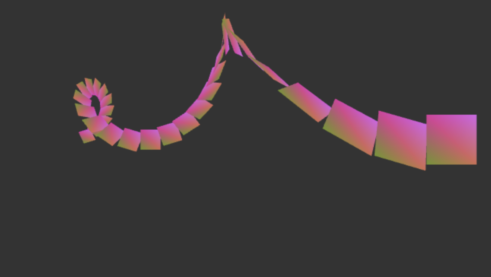

# WebGL Demo in Common Lisp

Also it demonstrates how to send pieces of JS code to the browser via Websocket.

This is just demo code shown in [my websocket/webgl video](http://www.youtube.com/watch?v=aKYzfew1pnE) by Sungmin Park.

It's very experimental level.



#### Requirements
  - [Quicklisp](http://www.quicklisp.org)
  - Common Lisp Implementations
	+ [ClozureCL](http://www.clozure.com/clozurecl.html)
	+ [SBCL](http://www.sbcl.org)

#### Usage

Start REPL and do:

```
(load "load.lisp")
```

Then open "examples.lisp" and eval forms upto this line:

```
;;; open your webbrowser. then go to 127.0.0.1:8080/ws-repl.html
```

Open the page in the browser. It will connect back to the Lisp via a websocket and will wait for the commands.

Continue evaluating forms one by one and on the final form you should see an animation. Now you can play with
DRAW-SCENE function. For example, try to change a number of loops in DOTIMES form.
